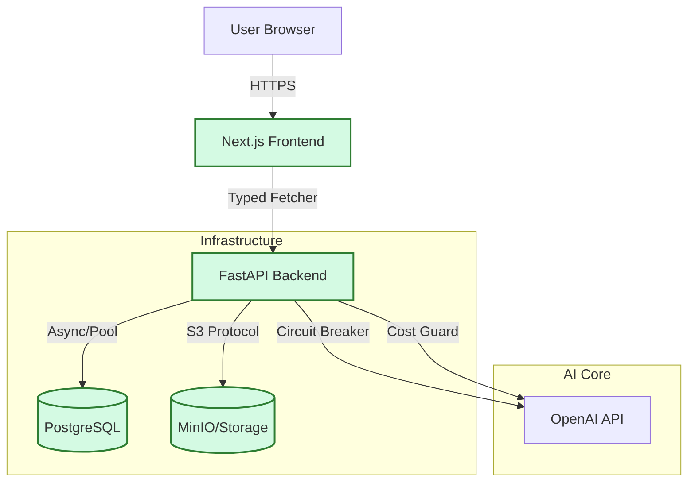

# Restricted Diet Cookbook AI 🧑‍🍳🥦

> **An AI-powered recipe generator that respects your dietary restrictions.**
> *Production-Ready Monorepo | Contract-First API | AI Reliability Guards*

---

## 🎯 Problem & Solution
Navigating a restricted diet (allergies, intolerances, or specific lifestyles like Keto/Vegan) often means settling for generic recipes or spending hours manually filtering search results. The challenge is finding a meal that is both **safe** and **achievable** with the ingredients currently in your pantry.

**Cookbook AI** delivers a professional, engineering-first solution:
1.  **Visual Ingredient Capture**: Snap a photo of your fridge or pantry to automatically identify base ingredients (Vision-Powered Simulation).
2.  **Hard Constraint Enforcement**: A strict dietary profile ensures the AI honors your restrictions—guaranteeing personal safety and culinary trust.
3.  **Tailored Gourmet Generation**: Leveraging OpenAI GPT-4o with structured output to produce high-quality, chef-grade recipes in seconds.
4.  **The Showcase Loop**: Document your success by uploading photos of your final cooked dishes, building a personalized gallery of safe culinary wins.

**Live Demo**: [Place URL Here] (Managed by maintainer)

---

## 🏗️ Architecture



## 🛠️ Tech Stack & Roles
*   **Web (`apps/web`)**: Next.js 14, Tailwind CSS, Shadcn UI. Handles User Journey, Wizard State, and client-side validation.
*   **API (`apps/api`)**: Python FastAPI. Handles business logic, DB interactions, AI orchestration, and storage presigning.
*   **Client (`packages/api-client`)**: Shared TypeScript library. Auto-generated from OpenAPI specs to ensure type safety.
*   **DB**: PostgreSQL (Relational data for Recipes/Users).
*   **Storage**: MinIO (S3-compatible object storage for photo uploads).

---

## 🛡️ Contract Enforcement (Rubric: Best Practices)
We strictly enforce the API contract between Frontend and Backend to prevent "drift breakdown".

1.  **Single Source of Truth**: `openapi.yaml` at the root defines the schema.
2.  **Auto-Generation**: `pnpm gen:client` generates a fully typed TypeScript client (`openapi-fetch`) in `packages/api-client`.
    *   *Result*: Frontend compilation FAILS if the API spec changes without updating client usage.
3.  **Freshness Check**: CI runs `pnpm client:check` to ensure the generated code matches the current `openapi.yaml`.

---

## 🤖 AI Safety & Reliability (Rubric: AI Engineering)
This is not just a wrapper; it's an engineered AI service. See [prompts/AGENT_SYSTEM_PROMPTS.md](prompts/AGENT_SYSTEM_PROMPTS.md) for details on the agents used to build this.

1.  **Structured Output**: Uses Pydantic models to force strict JSON output from OpenAI (Ingredients, Instructions, Nutrition).
2.  **Failsafes**:
    *   **Circuit Breaker**: `tenacity` retry logic with exponential backoff for API timeouts.
    *   **Cost Guard**: Logic limits token usage/request frequency per user (simulated).
    *   **Mock Fallback**: If OpenAI is down (or key missing), the system gracefully degrades to a mock recipe generator for testing.

---

## ✅ Testing Strategy
*   **Unit Tests**: `vitest` for Frontend components, `pytest` for Backend logic.
*   **Integration Tests**: Backend tests spin up a real test DB (via `pytest-asyncio` and `testcontainers` strategy) to verify SQL constraints.
*   **E2E Tests**: Playwright (`apps/web/e2e`) runs the full "Wizard Flow" inside Docker container, validating the critical path from "Landing" to "Recipe Result".
*   **Coverage**: Target >60% (Configured in `vitest.config.ts` and `pyproject.toml`).

---

## 🚀 Local Development (Fresh Clone Guide)

**Prerequisites**: Docker Desktop, Node.js 20+, Pnpm.

1.  **Clone & Install**
    ```bash
    git clone https://github.com/your-username/restricted-diet-cookbook-ai.git
    cd restricted-diet-cookbook-ai
    pnpm install
    ```

2.  **Start Stack (Recommended)**
    Uses `run.sh` wrapper for Docker Compose.
    ```bash
    ./run.sh dev
    ```
    *   Frontend: `http://localhost:3000`
    *   Backend Docs: `http://localhost:8000/docs`
    *   MinIO Console: `http://localhost:9001`

3.  **Run Tests**
    ```bash
    ./run.sh test    # Runs Pytest (Backend) and Vitest (Frontend)
    ```

4.  **Verification**
    ```bash
    ./run.sh check   # Linting, Types, Client Freshness
    ```

---

## 🛳️ Production Deployment

For detailed production setup instructions, including environment optimization, storage endpoint handling, and scaling, see the [DEPLOYMENT.md](DEPLOYMENT.md) guide.

### Quick Start (Render)
1. Ensure your repository has the provided `render.yaml`.
2. Deploy via Render Blueprint.
3. Manually add `OPENAI_API_KEY` to the `cookbook-backend` service.

### New Features (v1.1)
- **User Management**: Registration, profile customization, and dietary preferences.
- **Show Your Dish**: Capability to upload photos of final cooked meals.
- **Enhanced Storage**: Robust S3 signature handling for public access.

### 3. CI/CD Pipeline
The repository includes GitHub Actions for:
* **Linting & Type Checking**: On every pull request.
* **Test Suite Execution**: Ensures no regressions before merge.
* **OpenAPI Client Check**: Validates that the frontend client is in sync with the backend.

---

## ☁️ Deployment (Render)

## 🔧 Troubleshooting

### Upload Fails (403 Forbidden)
*   **Cause**: Docker time drift causing S3 signature skew.
*   **Fix**: Restart Docker Desktop or sync system time.

### AI Generation Timeout
*   **Cause**: OpenAI latency spikes.
*   **Fix**: The built-in "Mock Mode" will auto-engage after 3 retries. Check backend logs for `[FallbackActivated]` message.

### "Client out of date" Error
*   **Cause**: Changed `openapi.yaml` but didn't regen client.
*   **Fix**: Run `./run.sh gen:client`.

---

## 📋 Rubric Evidence (Reviewer Checklist)

This section maps project components to the [Course Rubric](https://github.com/DataTalksClub/ai-dev-tools-zoomcamp/blob/main/project/README.md) (excluding AI Output Evaluation).

| Criterion | Evidence / Path | Verification Command |
| :--- | :--- | :--- |
| **1. Problem Definition** | [PRD.md](docs/PRD.md#1-problem-statement) | N/A (Doc Review) |
| **2. Interface** | [demo-script.md](presentation/demo-script.md) | `npm run dev` (Local UI) |
| **3. Data Ingestion** | [uploads.py (L70)](apps/api/app/api/routes/uploads.py#L70) | `curl /health` (Storage Check) |
| **4. Monitoring** | [VERIFICATION.md](docs/VERIFICATION.md) | View [JSON Log Proof](docs/VERIFICATION.md#1-structured-logging--request_id) |
| **5. Reproducibility** | [README.md](#-local-development-fresh-clone-guide) | `./run.sh dev` |
| **6. Testing** | [VERIFICATION.md](docs/VERIFICATION.md#3-test-coverage) | `./run.sh test` |
| **7. Best Practices** | [ADR 0001](docs/adr/0001-contract-first-openapi.md) | `pnpm client:check` |
| **8. Documentation** | `docs/` folder | Link review in README |
| **9. Deployment** | [render.yaml](render.yaml) | Check [Live Demo](#-live-demo) |

---

## 🏛️ ADRs (Architecture Decision Records)
We document key architectural decisions to ensure long-term maintainability.
- **[ADR 0001: Contract-First OpenAPI](docs/adr/0001-contract-first-openapi.md)**: Ensuring type safety between Frontend and Backend.
- **[ADR 0002: Multi-Backend Storage](docs/adr/0002-storage-strategy.md)**: Handling local dev vs production storage.

---

## 🏗️ Technical Documentation
- 📘 **[Architecture](docs/ARCHITECTURE.md)**: System design and mermaid diagrams.
- 📜 **[API Contract](docs/CONTRACT.md)**: OpenAPI patterns and error handling.
- 🚀 **[Deployment](DEPLOYMENT.md)**: Production setup and Render guide.
- 🔍 **[Observability](docs/observability.md)**: Logging and monitoring practices.

---

*Built with ❤️ by Camilo C.F. (AI Tooling Lead)*
