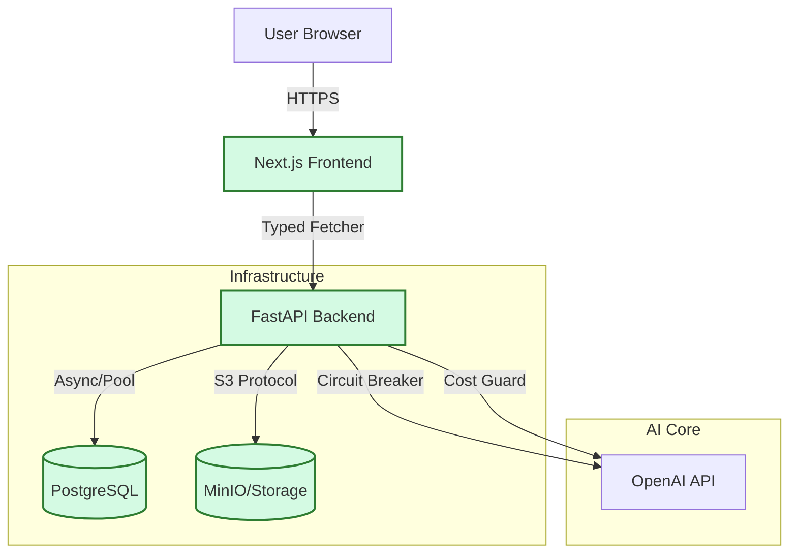

# Restricted Diet Cookbook AI 🧑‍🍳🥦

> **An AI-powered recipe generator that respects your dietary restrictions.**
> *Production-Ready Monorepo | Contract-First API | AI Reliability Guards*

---

## 🎯 Problem & Solution
People with restricted diets (allergies, intolerances, lifestyle choices) struggle to find recipes that use the ingredients they *already have* without violating their constraints.
**Cookbook AI** solves this by:
1.  **Scanning Ingredients**: Upload a photo of your fridge/pantry (Simulated Analysis).
2.  **Respecting Restrictions**: Hard constraints on allergies and diets.
3.  **Generating Custom Recipes**: Using OpenAI GPT-4 to create safe, tailored recipes.

**Demo URL**: [https://restricted-diet-cookbook-ai.onrender.com](https://restricted-diet-cookbook-ai.onrender.com) (Example Deployment)

---

## 🏗️ Architecture



## 🛠️ Tech Stack & Roles
*   **Web (`apps/web`)**: Next.js 14, Tailwind CSS, Shadcn UI. Handles User Journey, Wizard State, and client-side validation.
*   **API (`apps/api`)**: Python FastAPI. Handles business logic, DB interactions, AI orchestration, and storage presigning.
*   **Client (`packages/api-client`)**: Shared TypeScript library. Auto-generated from OpenAPI specs to ensure type safety.
*   **DB**: PostgreSQL (Relational data for Recipes/Users).
*   **Storage**: MinIO (S3-compatible object storage for photo uploads).

---

## 🛡️ Contract Enforcement (Rubric: Best Practices)
We strictly enforce the API contract between Frontend and Backend to prevent "drift breakdown".

1.  **Single Source of Truth**: `openapi.yaml` at the root defines the schema.
2.  **Auto-Generation**: `pnpm gen:client` generates a fully typed TypeScript client (`openapi-fetch`) in `packages/api-client`.
    *   *Result*: Frontend compilation FAILS if the API spec changes without updating client usage.
3.  **Freshness Check**: CI runs `pnpm client:check` to ensure the generated code matches the current `openapi.yaml`.

---

## 🤖 AI Safety & Reliability (Rubric: AI Engineering)
This is not just a wrapper; it's an engineered AI service. See [prompts/AGENT_SYSTEM_PROMPTS.md](prompts/AGENT_SYSTEM_PROMPTS.md) for details on the agents used to build this.

1.  **Structured Output**: Uses Pydantic models to force strict JSON output from OpenAI (Ingredients, Instructions, Nutrition).
2.  **Failsafes**:
    *   **Circuit Breaker**: `tenacity` retry logic with exponential backoff for API timeouts.
    *   **Cost Guard**: Logic limits token usage/request frequency per user (simulated).
    *   **Mock Fallback**: If OpenAI is down (or key missing), the system gracefully degrades to a mock recipe generator for testing.

---

## ✅ Testing Strategy
*   **Unit Tests**: `vitest` for Frontend components, `pytest` for Backend logic.
*   **Integration Tests**: Backend tests spin up a real test DB (via `pytest-asyncio` and `testcontainers` strategy) to verify SQL constraints.
*   **E2E Tests**: Playwright (`apps/web/e2e`) runs the full "Wizard Flow" inside Docker container, validating the critical path from "Landing" to "Recipe Result".
*   **Coverage**: Target >60% (Configured in `vitest.config.ts` and `pyproject.toml`).

---

## 🚀 Local Development (Fresh Clone Guide)

**Prerequisites**: Docker Desktop, Node.js 20+, Pnpm.

1.  **Clone & Install**
    ```bash
    git clone https://github.com/your-username/restricted-diet-cookbook-ai.git
    cd restricted-diet-cookbook-ai
    pnpm install
    ```

2.  **Start Stack (Recommended)**
    Uses `run.sh` wrapper for Docker Compose.
    ```bash
    ./run.sh dev
    ```
    *   Frontend: `http://localhost:3000`
    *   Backend Docs: `http://localhost:8000/docs`
    *   MinIO Console: `http://localhost:9001`

3.  **Run Tests**
    ```bash
    ./run.sh test    # Runs Pytest (Backend) and Vitest (Frontend)
    ```

4.  **Verification**
    ```bash
    ./run.sh check   # Linting, Types, Client Freshness
    ```

---

## 🛳️ Production Deployment

For a robust production environment, we recommend using Docker with a process manager or orchestrator.

### 1. Build and Run (Docker)
```bash
# Build production images and start in detached mode
docker compose -f docker-compose.yml up --build -d
```

### 2. Environment Configuration
Ensure your `.env` file contains production-ready secrets:
* `DATABASE_URL`: Point to a persistent RDS/Postgres instance.
* `SECRET_KEY`: Generate a long, random alphanumeric string.
* `OPENAI_API_KEY`: Ensure billing is active.
* `AWS_ENDPOINT_URL`: If using AWS S3 instead of MinIO, update to the regional endpoint.

### 3. CI/CD Pipeline
The repository includes GitHub Actions for:
* **Linting & Type Checking**: On every pull request.
* **Test Suite Execution**: Ensures no regressions before merge.
* **OpenAPI Client Check**: Validates that the frontend client is in sync with the backend.

---

## ☁️ Deployment (Render)

## 🔧 Troubleshooting

### Upload Fails (403 Forbidden)
*   **Cause**: Docker time drift causing S3 signature skew.
*   **Fix**: Restart Docker Desktop or sync system time.

### AI Generation Timeout
*   **Cause**: OpenAI latency spikes.
*   **Fix**: The built-in "Mock Mode" will auto-engage after 3 retries. Check backend logs for `[FallbackActivated]` message.

### "Client out of date" Error
*   **Cause**: Changed `openapi.yaml` but didn't regen client.
*   **Fix**: Run `./run.sh gen:client`.

---

## 🎬 2-Minute Demo Script

1.  **Setup**: Run `./run.sh dev` and open `localhost:3000`.
2.  **Start Wizard**: Click "Create Recipe".
3.  **Ingredients**: Type "Chicken breast, spinach, heavy cream".
4.  **Restrictions**: Type "Keto, No Nuts".
5.  **Upload (Optional)**: Drag & drop any image (e.g. `fridge.jpg`). Watch the upload progress bar (Simulated S3).
6.  **Review**: See the summary. Click "Generate Recipe".
7.  **Result**: Observe the Loading State (Skeleton UI).
    *   *Win*: See "Keto Creamy Spinach Chicken".
    *   *Verify*: Check that standard "Serving Size" and "Nutrition" data is present.
8.  **Resiliency Demo**: Kill the backend (`docker compose stop backend`). Try to generate. Observe the specific "Service Unavailable" error banner instead of a generic crash.

---
*Built with ❤️ by Camilo C.F. (AI Tooling Lead)*
